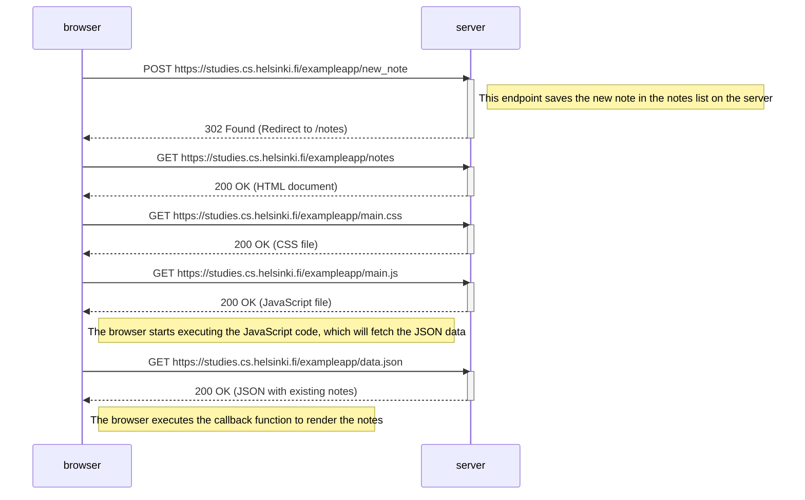

```mermaid
sequenceDiagram
    participant browser
    participant server

    %% The user fills out the form and clicks "Save"
    browser->>server: POST https://studies.cs.helsinki.fi/exampleapp/new_note
    activate server
    Note right of server: This endpoint saves the new note in the notes list on the server
    server-->>browser: 302 Found (Redirect to /notes)
    deactivate server

    %% The browser follows the redirection and requests /notes
    browser->>server: GET https://studies.cs.helsinki.fi/exampleapp/notes
    activate server
    server-->>browser: 200 OK (HTML document)
    deactivate server

    %% The browser requests additional resources (CSS and JS)
    browser->>server: GET https://studies.cs.helsinki.fi/exampleapp/main.css
    activate server
    server-->>browser: 200 OK (CSS file)
    deactivate server

    browser->>server: GET https://studies.cs.helsinki.fi/exampleapp/main.js
    activate server
    server-->>browser: 200 OK (JavaScript file)
    deactivate server

    Note right of browser: The browser starts executing the JavaScript code, which will fetch the JSON data

    %% The browser requests the notes data
    browser->>server: GET https://studies.cs.helsinki.fi/exampleapp/data.json
    activate server
    server-->>browser: 200 OK (JSON with existing notes)
    deactivate server

    Note right of browser: The browser executes the callback function to render the notes

```
