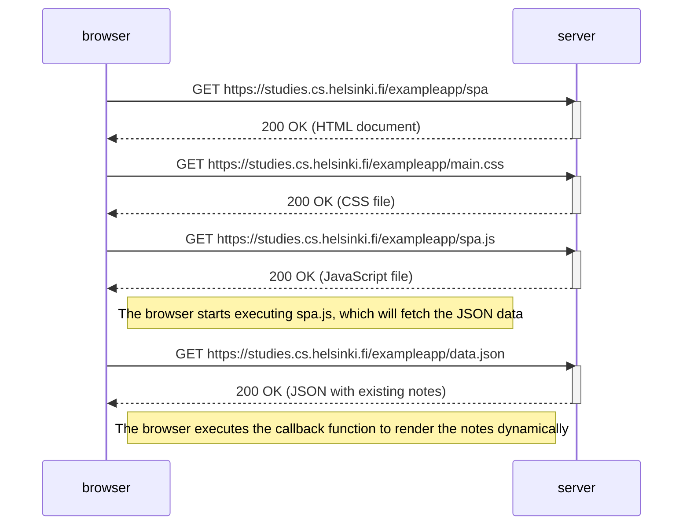

```mermaid
sequenceDiagram
    participant browser
    participant server

    %% The user navigates to the SPA version of the notes app
    browser->>server: GET https://studies.cs.helsinki.fi/exampleapp/spa
    activate server
    server-->>browser: 200 OK (HTML document)
    deactivate server

    %% The browser requests additional resources (CSS and JS)
    browser->>server: GET https://studies.cs.helsinki.fi/exampleapp/main.css
    activate server
    server-->>browser: 200 OK (CSS file)
    deactivate server

    browser->>server: GET https://studies.cs.helsinki.fi/exampleapp/spa.js
    activate server
    server-->>browser: 200 OK (JavaScript file)
    deactivate server

    Note right of browser: The browser starts executing spa.js, which will fetch the JSON data

    %% The browser requests the notes data
    browser->>server: GET https://studies.cs.helsinki.fi/exampleapp/data.json
    activate server
    server-->>browser: 200 OK (JSON with existing notes)
    deactivate server

    Note right of browser: The browser executes the callback function to render the notes dynamically

```
