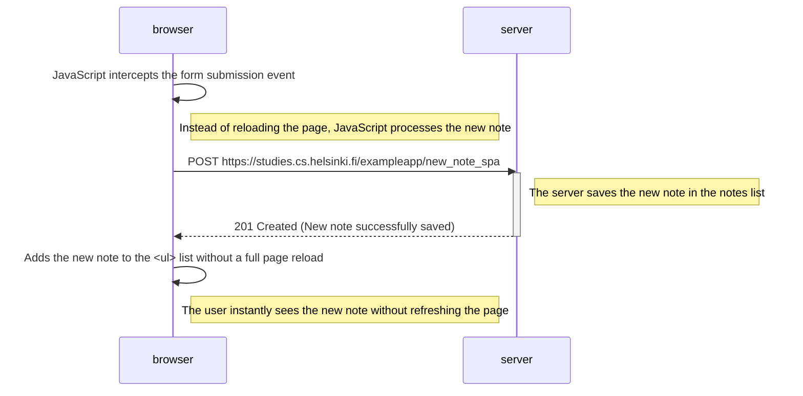

```mermaid
sequenceDiagram
    participant browser
    participant server

    %% The user submits a new note, but JavaScript prevents the default form submission
    browser->>browser: JavaScript intercepts the form submission event
    Note right of browser: Instead of reloading the page, JavaScript processes the new note

    %% JavaScript sends the new note to the server
    browser->>server: POST https://studies.cs.helsinki.fi/exampleapp/new_note_spa
    activate server
    Note right of server: The server saves the new note in the notes list
    server-->>browser: 201 Created (New note successfully saved)
    deactivate server

    %% JavaScript updates the UI dynamically
    browser->>browser: Adds the new note to the <ul> list without a full page reload
    Note right of browser: The user instantly sees the new note without refreshing the page

```
